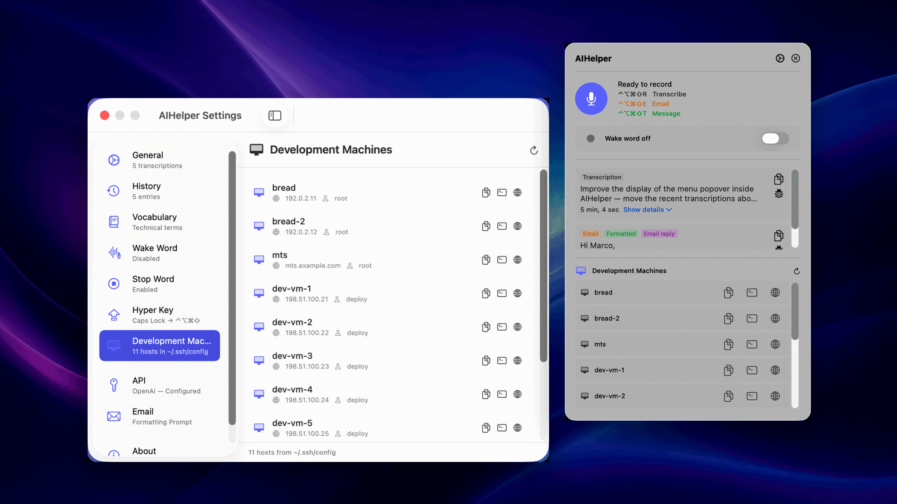
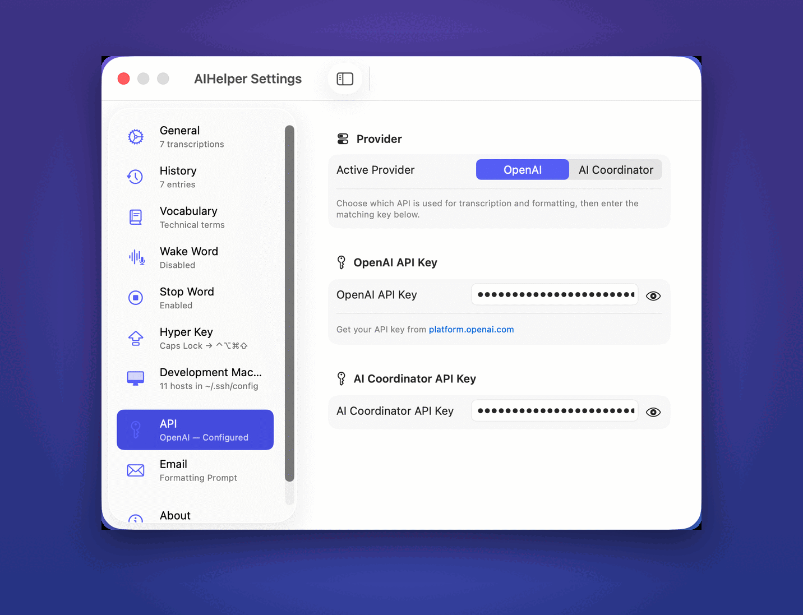
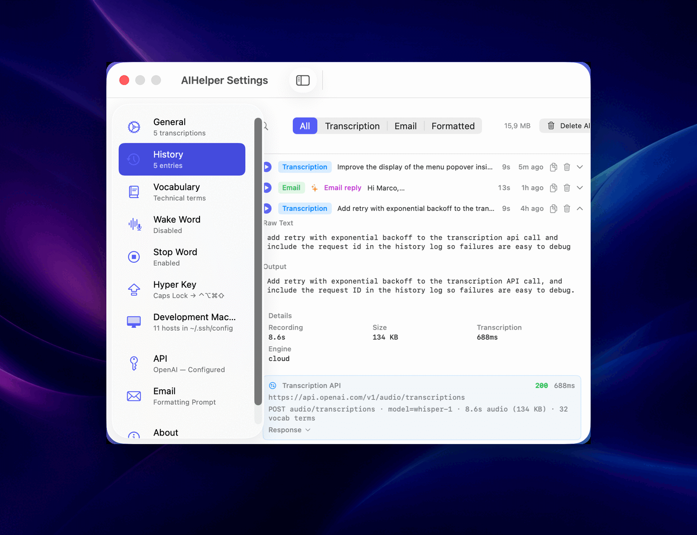
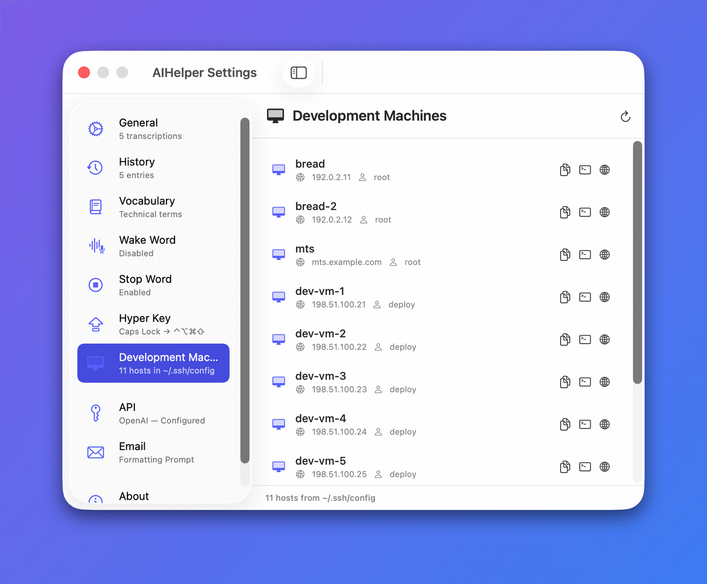
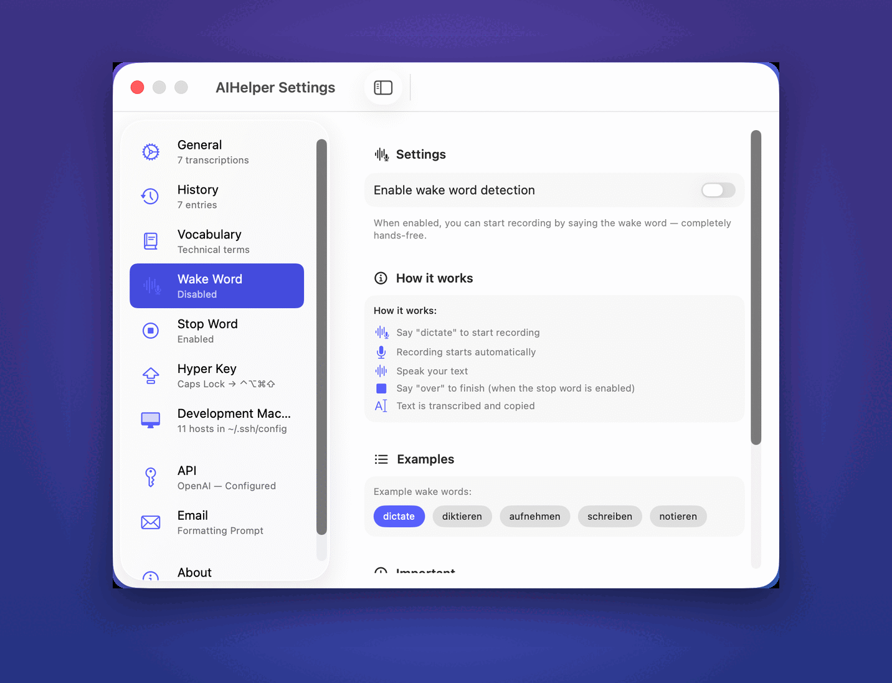
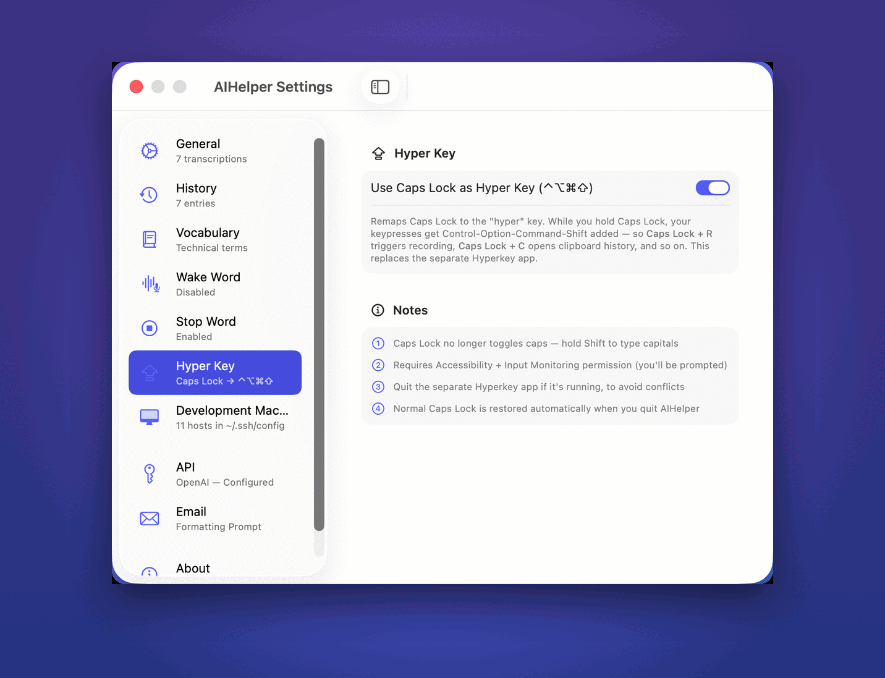
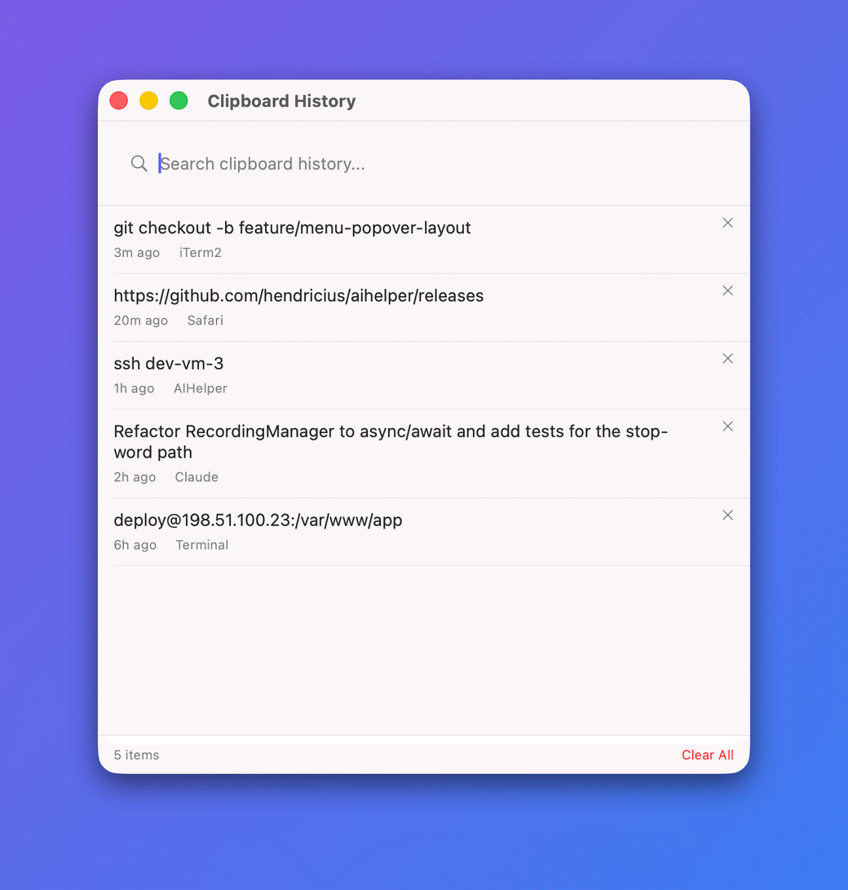
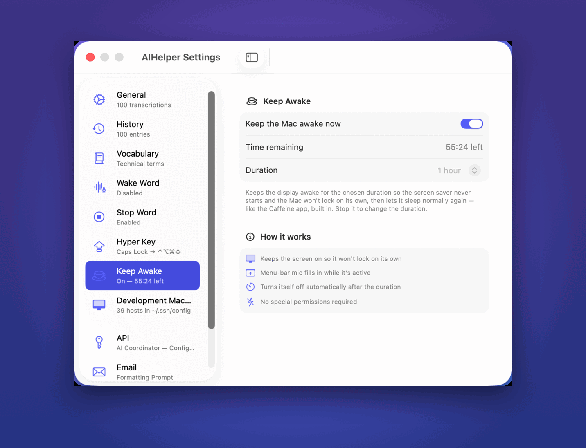
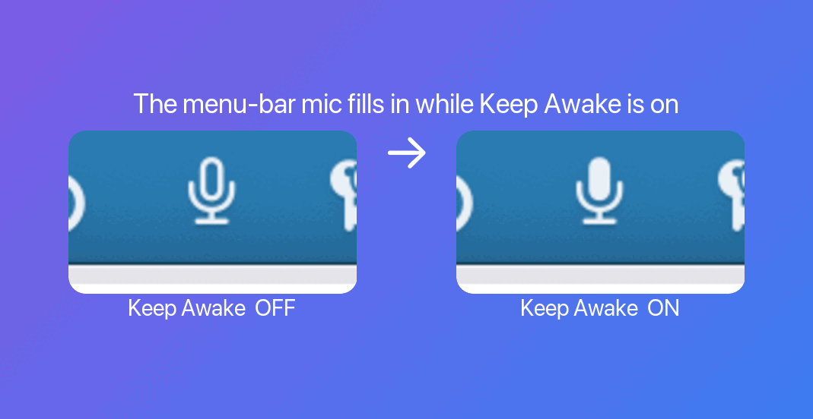

# AIHelper

A macOS menu-bar app for fast voice transcription and AI text formatting. Record with a
global hotkey, get an instant transcription, and optionally reformat it into a clean email
or casual message — all from the menu bar. It also ships with a **built-in Hyper Key**
(Caps Lock → ⌃⌥⌘⇧), so you don't need a separate Hyperkey app. Bring your own API key.

**Open source · MIT licensed · created by Hendrik Kleinwächter.**

<p align="center">
  
</p>

## Download

Grab the latest pre-built app from the [Releases page](https://github.com/hendricius/aihelper/releases),
unzip it, and drag `AIHelper.app` into `/Applications`.

It's signed with a Developer ID and notarized by Apple, so it opens normally — no Gatekeeper
workaround needed.

Prefer to build it yourself? See [Setup](#setup).

## Recording shortcut · built-in Hyper Key

Every global shortcut uses **⌃⌥⌘⇧** (Control-Option-Command-Shift) plus a letter — for example
**⌃⌥⌘⇧R** to record. That five-finger chord is awkward on its own, so AIHelper has a built-in
**Hyper Key** that's **on by default**: it remaps **Caps Lock** to act as ⌃⌥⌘⇧. With it enabled
you just press:

- **Caps Lock + R** — start / stop recording
- **Caps Lock + E** — reformat your dictation into an email reply
- **Caps Lock + T** — reformat into a casual message to a friend
- **Caps Lock + C** — open clipboard history

This replaces the separate [Hyperkey](https://hyperkey.app) app — no extra tool needed. While the
Hyper Key is on, Caps Lock no longer toggles caps (hold Shift to type capitals), and normal Caps
Lock behavior is restored automatically when you quit AIHelper. You can turn it off any time in
**Settings → Hyper Key**.

## Features

- ⌨️ Built-in **Hyper Key** (on by default): Caps Lock becomes ⌃⌥⌘⇧, so **Caps Lock + R** records — no separate Hyperkey app needed
- 🎙️ One-click / global-hotkey audio recording (`⌃⌥⌘⇧R`)
- ✍️ AI transcription — **OpenAI by default**; just add your OpenAI API key and you're set (AI Coordinator is also supported)
- 📧 Reformat dictation into a professional email reply, with your **own custom email formatting prompt**
- 💬 **Informal mode** — turn dictation into a casual message to a friend (`⌃⌥⌘⇧T`)
- 🛑 **Stop word**: say a word like *"over"* and recording stops automatically, then the text is inserted right at your cursor
- 🗣️ Hands-free recording: start with a wake word too (speech recognition runs locally)
- 🖥️ **Development Machines** overview — every host from your `~/.ssh/config`, with one-click copy / Terminal / browser
- 🧠 Custom vocabulary to improve spelling of names and technical terms
- 📋 Clipboard history manager (`⌃⌥⌘⇧C`)
- ☕ **Keep Awake** — a built-in [Caffeine](https://www.caffeine-app.net/): keep your Mac awake so the screen won't lock, for a chosen 1–5 hours, so you don't need the separate Caffeine app. The menu-bar mic fills in while it's active, like Caffeine's full cup
- 📜 Transcription history with audio playback and full API debug logging — a growing archive of your own voice and phrasing (handy for, say, training a voice clone of yourself later)

## Screenshots

<table>
  <tr>
    <td width="50%" valign="top">
      <br>
      <b>Bring your own key</b> — OpenAI by default, AI Coordinator also supported. Pick the active provider and paste the matching key.
    </td>
    <td width="50%" valign="top">
      <br>
      <b>History + full API debug logging</b> — raw dictation, formatted output, timings, and every API call (endpoint, status, response) for each transcription.
    </td>
  </tr>
  <tr>
    <td width="50%" valign="top">
      <br>
      <b>Development Machines</b> — every host from your <code>~/.ssh/config</code>, with one-click copy <code>ssh</code>, open in Terminal, or open in the browser.
    </td>
    <td width="50%" valign="top">
      <br>
      <b>Hands-free wake word</b> — say a word to start recording. Speech recognition runs locally on your Mac.
    </td>
  </tr>
  <tr>
    <td width="50%" valign="top">
      <br>
      <b>Built-in Hyper Key</b> — Caps Lock becomes ⌃⌥⌘⇧, so <b>Caps Lock + R</b> records — no separate Hyperkey app needed.
    </td>
    <td width="50%" valign="top">
      <br>
      <b>Clipboard history</b> — a searchable history of what you copied, opened with <code>⌃⌥⌘⇧C</code>.
    </td>
  </tr>
  <tr>
    <td width="50%" valign="top">
      <br>
      <b>Keep Awake (built-in Caffeine)</b> — replaces the classic <a href="https://www.caffeine-app.net/">Caffeine</a> app: keep your Mac awake so the screen won't lock, for a chosen 1–5 hours, then it sleeps normally again.
    </td>
    <td width="50%" valign="top">
      <br>
      <b>Glanceable menu-bar icon</b> — the mic fills in while Keep Awake is on, like Caffeine's full cup.
    </td>
  </tr>
</table>

## Requirements

- macOS 14.0 (Sonoma) or later
- An API key for at least one provider:
  - **OpenAI** — get a key at <https://platform.openai.com/api-keys>
  - **AI Coordinator** — get a key at <https://aicoordinator.spacebread.dev>
- To build from source: Xcode 15.0 or later

## Choosing a provider (bring your own key)

By default AIHelper uses **OpenAI** — just open **Settings → API**, paste in your OpenAI API key,
and transcription works. If you'd rather use **AI Coordinator**, enter that key instead and switch
the **Active Provider**. The active provider is used for both transcription and formatting. Both
providers speak the same OpenAI-compatible API shape; only the endpoint, key, and model differ.

## Development Machines

If you SSH into dev boxes or VMs, **Settings → Development Machines** lists every host from your
`~/.ssh/config`. Each row gives you one-click actions to copy the `ssh` command, open it in a new
Terminal tab, or open it in your browser — and you can mark one as the default target for screenshot
transfer. Nothing is sent anywhere; it just reads your local SSH config.

## Customizing transcription

- **Custom vocabulary** (`Settings → Vocabulary`) — add names and technical terms so they're spelled correctly.
- **Stop word** (`Settings → Stop Word`) — pick a word like *"over"*; when you say it, recording stops and the text is inserted at your cursor (optionally pressing Enter for you).
- **Email & message prompts** (`Settings → Email`) — write your own formatting prompt with `{{selected_text}}` and `{{transcription}}` placeholders.
- **History** (`Settings → History`) — every transcription is kept with its audio and full API logs: a personal archive of how you speak and write.

## Setup (build from source)

1. Clone the repository:
   ```bash
   git clone https://github.com/hendricius/aihelper.git
   cd aihelper
   ```

2. (Optional) Preload an API key from a `.env` file:
   ```bash
   cp .env.example .env
   ```
   Edit `.env` and fill in the key(s) for the provider(s) you use:
   ```
   OPENAI_API_KEY=sk-your-openai-key-here
   AIC_API_KEY=your-aicoordinator-key-here
   ```
   `make load-env` (run automatically by `make build`) writes these into the app's settings.
   You can also just type the key(s) into the app: **Settings → API**.

3. Build and run:
   ```bash
   make open
   ```

## Available commands

| Command | Description |
|---------|-------------|
| `make build` | Build the debug version |
| `make open` | Build and launch the app |
| `make clean` | Clean build artifacts |
| `make install` | Install to /Applications |
| `make load-env` | Load API key(s) from `.env` into the app's settings |

## Permissions

- **Microphone** — required for audio recording (System Settings → Privacy & Security → Microphone)
- **Accessibility** — required for the global keyboard shortcuts (System Settings → Privacy & Security → Accessibility)
- **Input Monitoring** — required for the built-in Hyper Key (Caps Lock → ⌃⌥⌘⇧)
- **Speech Recognition** — required for the wake-word / stop-word hands-free mode (runs locally)

## Project structure

```
AIHelper/
├── AIHelperApp.swift                  # Entry point, menu bar setup
├── AppDelegate.swift                  # App lifecycle, global hotkeys
├── ContentView.swift                  # Menu-bar popover UI
├── SettingsView.swift                 # Settings (API, vocabulary, wake/stop word, hyper key, dev machines, history, about)
├── HyperKeyManager.swift              # Built-in Caps Lock → ⌃⌥⌘⇧ hyper key
├── CaffeineManager.swift              # Keep Awake (IOKit power assertion, 1–5h)
├── APIProvider.swift                  # OpenAI / AI Coordinator provider abstraction
├── WhisperService.swift               # Audio transcription (provider-routed)
├── FormattingService.swift            # Email / message formatting (provider-routed)
├── TranscriptionServiceRouter.swift   # Transcription routing + timeout
├── RecordingManager.swift             # Orchestrates recording + transcription
├── WakeWordDetector.swift / StopWordDetector.swift  # Hands-free recording
├── SSHConfigParser.swift              # Parses ~/.ssh/config for Development Machines
├── DevelopmentMachines*.swift         # Development Machines list (from ~/.ssh/config)
├── ClipboardHistory*.swift            # Clipboard history manager
└── Models/                            # Data models
```

## License

MIT — see [LICENSE](./LICENSE).
